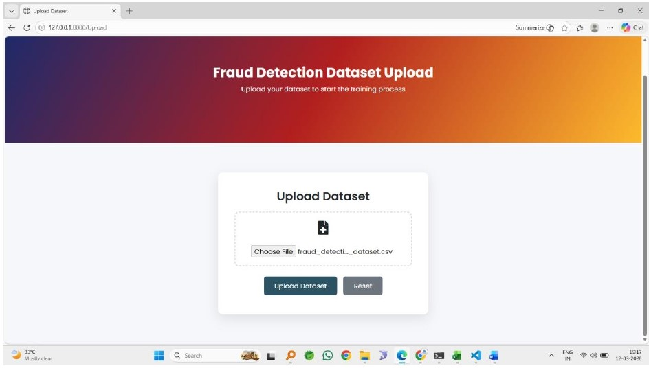
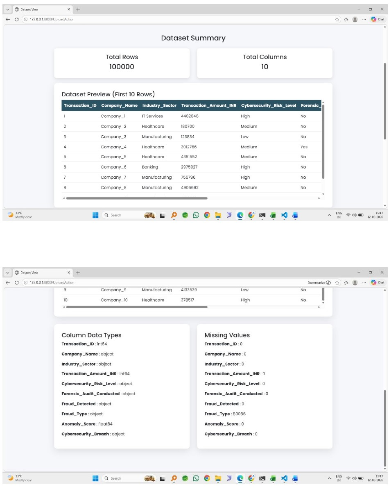
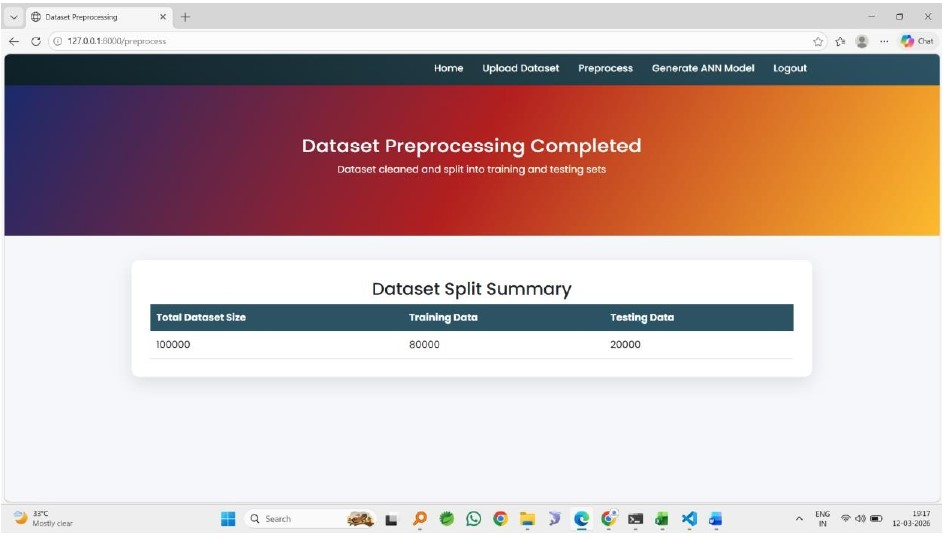
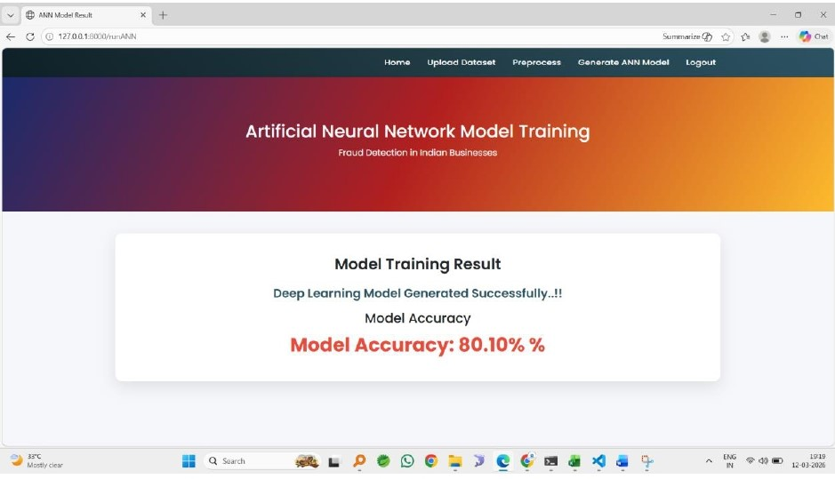
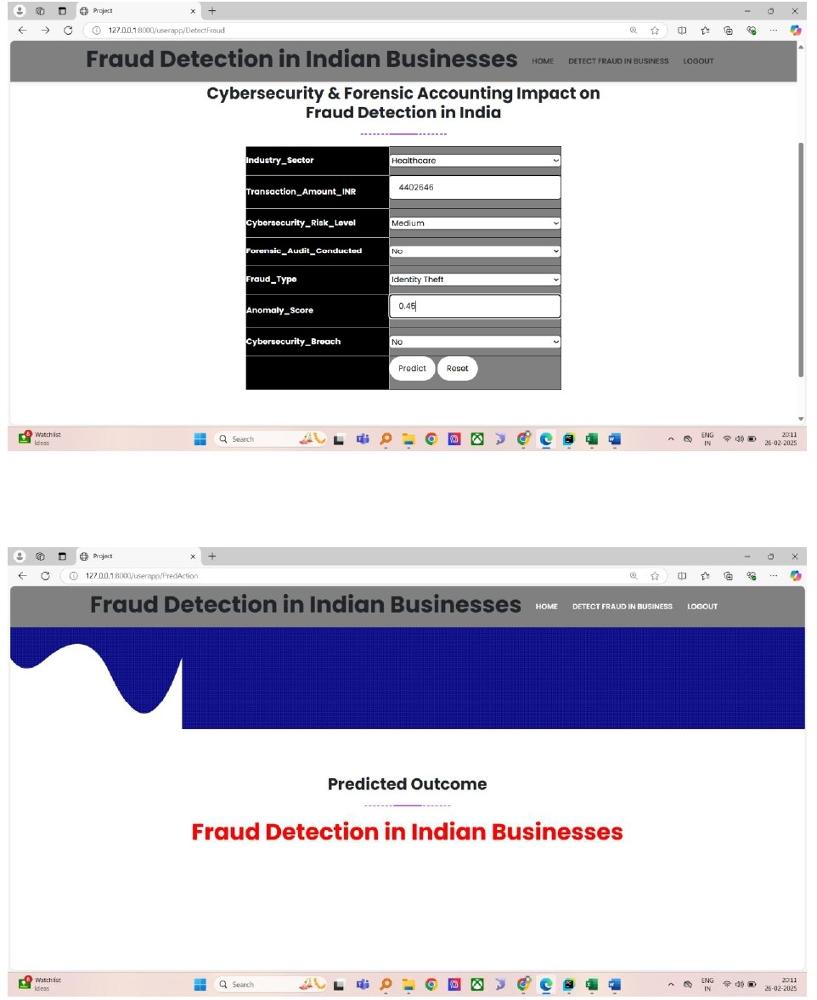

# AI-Based-Fraud-Detection-System-using-ANN
A machine learning-based fraud detection system that uses Artificial Neural Networks (ANN) to identify fraudulent financial transactions by integrating cybersecurity and forensic accounting techniques.

## Features

* Fraud detection using ANN model
* Real-time transaction prediction
* Data preprocessing and feature engineering
* Admin module for dataset upload and model training
* User module for fraud prediction


## Tech Stack

* Python
* Django
* TensorFlow / Keras
* MySQL
* Pandas, NumPy, Scikit-learn


## Workflow

Dataset → Preprocessing → Model Training → Prediction → Result

## Screenshots

### Admin Dashboard


### Upload Dataset


### Dataset Preview


### Preprocessing Output


### Model Accuracy


### Prediction Result

## Installation

```bash
git clone https://github.com/Mohammad-Sufiyan-Safdar/AI-Based-Fraud-Detection-System-using-ANN
cd AI-Based-Fraud-Detection-System-using-ANN
pip install -r requirements.txt
python manage.py runserver
```

---

## How It Works

1. Admin uploads dataset
2. Data is preprocessed (cleaning, encoding, scaling)
3. ANN model is trained
4. User enters transaction data
5. System predicts whether the transaction is fraudulent or legitimate


## Results

* Improved fraud detection accuracy
* Faster detection compared to traditional methods
* Efficient handling of large datasets


## Future Improvements

* Deployment on AWS (EC2, S3)
* API development using Django REST Framework
* Real-time alert system


## Author

Mohammad Sufiyan Safdar
Email: [sufiyansafdar28@gmail.com](mailto:sufiyansafdar28@gmail.com)
GitHub: https://github.com/Mohammad-Sufiyan-Safdar


